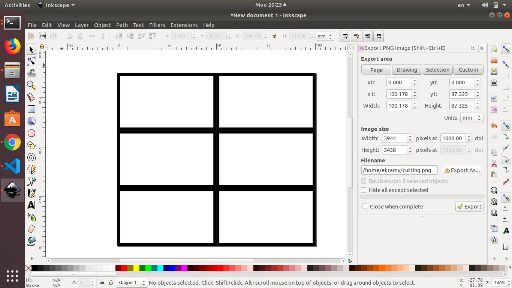

# TOT
- making a circuit board
    - search on goolge for fabisp
    - open mit fablab
    - download milling and cutting png files
    - open inkscape
    - we want to make 6 milling and cutting on one board
    - file > document properties > write the size of all pcb's wanted (100*150 mm) size for 6 boards
    - then we put the png of the board wanted on inkscape and repeat it 5 times
    - then we go to file > document properties > resize > resize page
    - export page with 1000 dpi
    - then repeat the same with the cutting   
       
       
- calibrating the cable by connecting the hock of channel one to the test signal metal   

- Arduino
    - check the microcontroller model from the arduino board
    - search for it on google `atmega 328p datasheet`
    - download pdf file
    - to install to toolchain `sudo apt install ardude gcc-avr avr-libc` : so i can compile the code
    - to check that arduino is connected   
    `cd /dev/`   
    `ls`   
    - remove the arduino cable to make sure it is the connected devie
    - use `ls` again the arduino will appear as `acm0`
    - use `ls tty*` to show all `tty` begin with these names
    - `ls -l /dev/ttyACM*` : another command to check
    - it will be `ttyACM0`
    - `dmesg -w` to check the live action on connected or disconnected device
    - to install arduino
        - 

